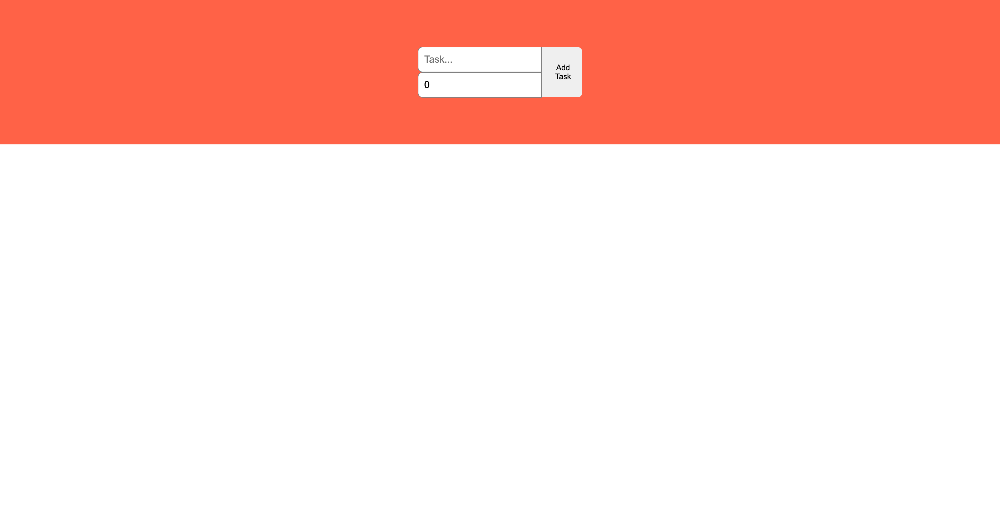
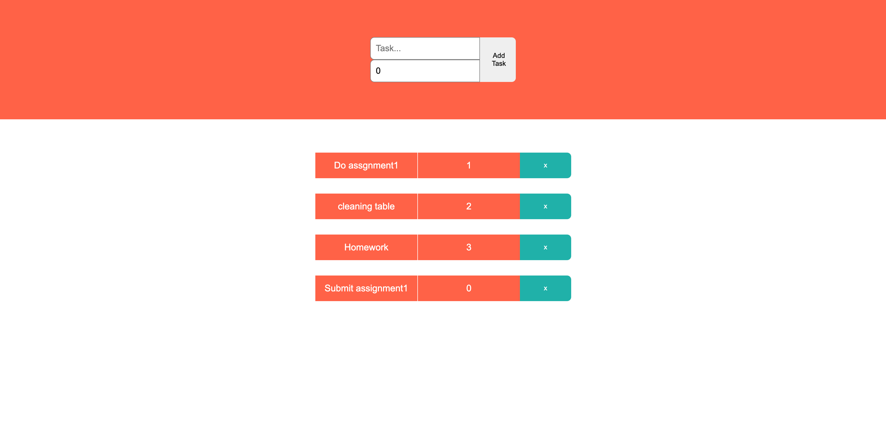
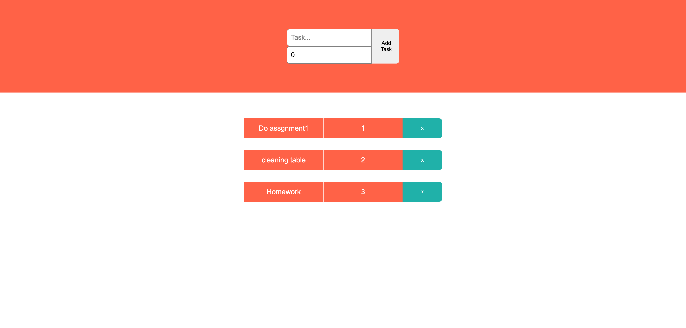

## What project is it?

My first TypeScript project. It is just simple todolist application.

## Languages

## How to run this program?

1. Download the master project brach or clone the git repository
2. To install node modules, run the following command. `npm install`
3. Type the following command for start this program. `npm start`

## Functions and screenshots

Add todolist

*****

*****

*****

Delete todolist

